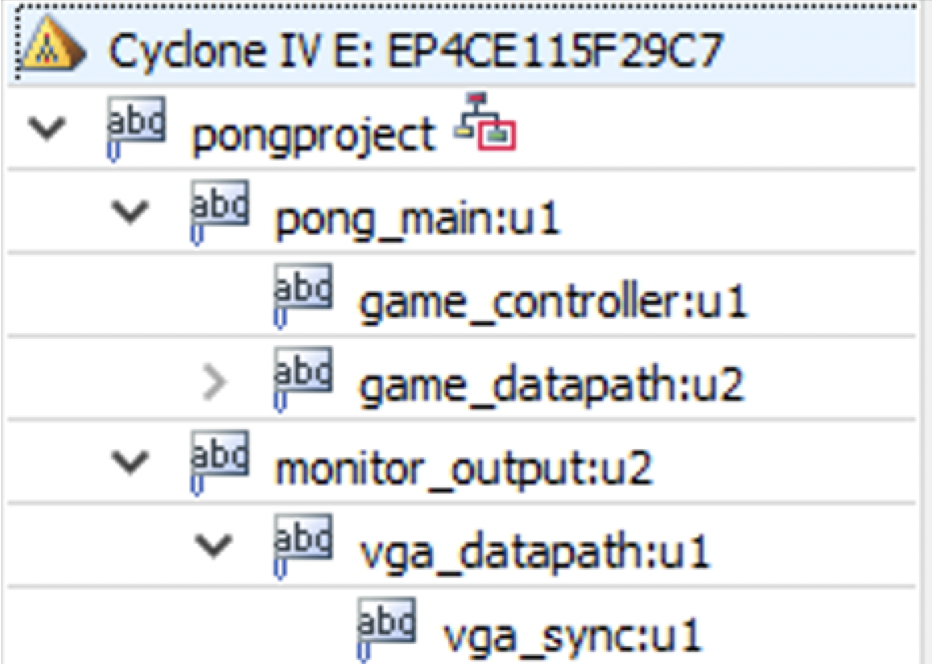
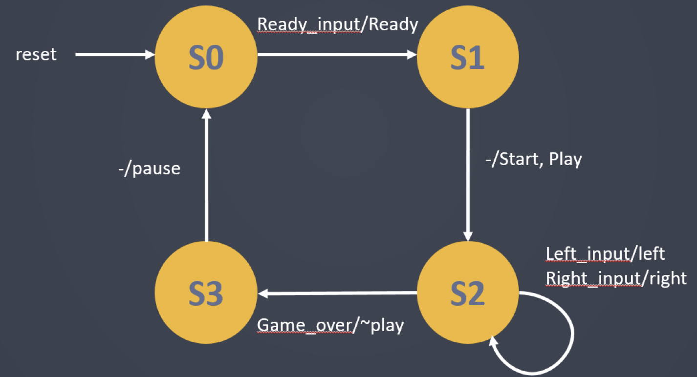
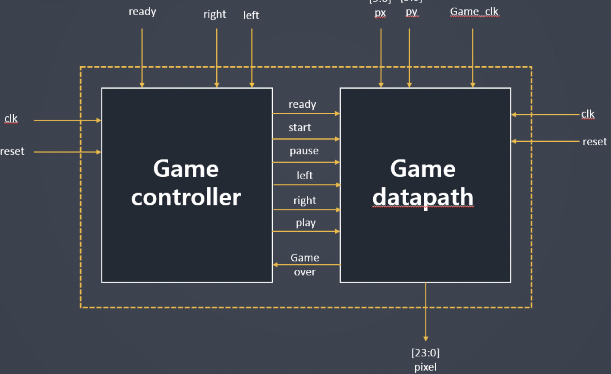

# DE2_pong_game
Using FPGA Altera DE2 board, developed ping pong game. (One player only)    

# Project Files - Module

- pongproject : Top module. It combiles pong_main and monitor_output.
- pong_main : Related to the pong game.
- monitor_output : It's about monitor output throughout VGA.    
   

# State Diagram

  
  
# Block Diagram

  